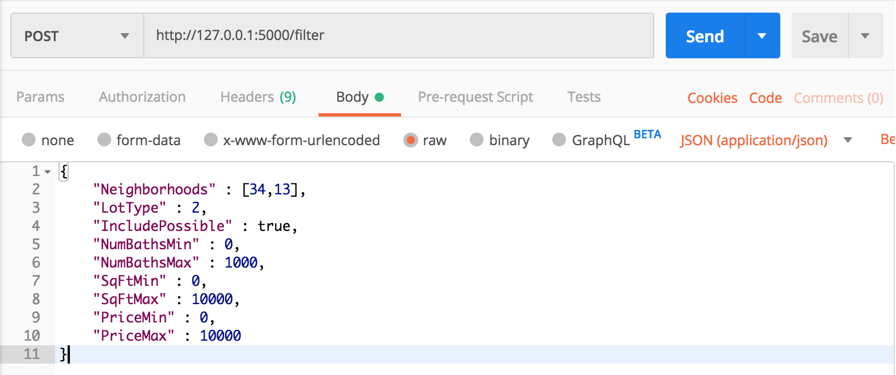
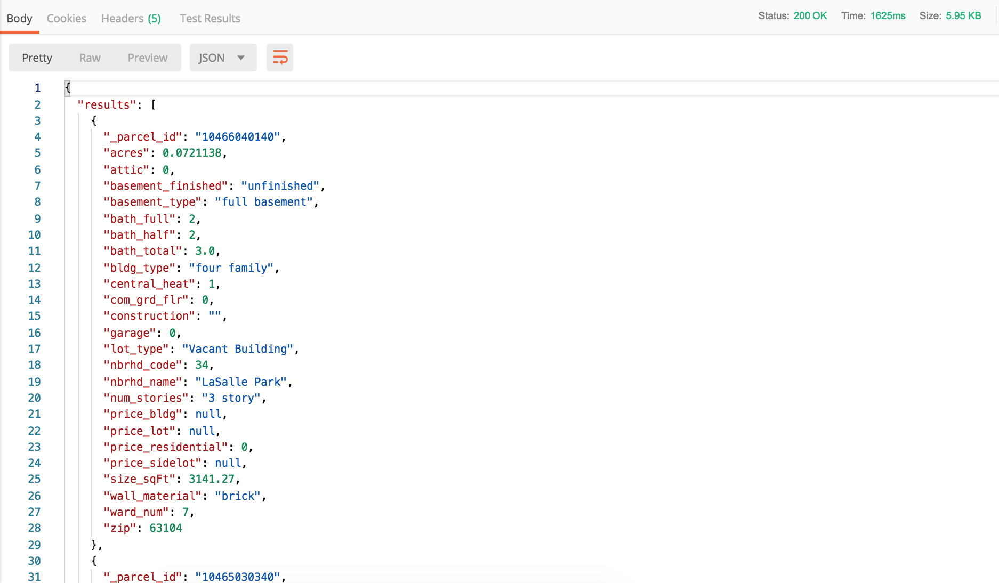

## Backend
### Prerequisites
 - **Python** :snake:
   - **Python3** - Python language interpreter
   - **Pip** - Python package manager
   - **Virtualenv** - Python environment manager
 - **Postman** - Tool to send API requests and read responses. [(Get Postman)](https://www.getpostman.com/downloads/)
 - **Login credentials to OpenSTL Database** - Please contact repo owner for credentials
 - **GitBash** - [(Get this only if you have Windows operating system)](https://git-scm.com/downloads)

### Installing
 ##### Create virtual environment
 1. Create a Python 3 environment. Replace ``[envname]`` with an environment name that makes sense.
 ```
 virtualenv -p python3 [envname]
 ```
 Once environment is created, run:

 For Mac or Linux,
 ```
 source [envname]/bin/activate
 ```

 For Windows,
 ```
 source [envname]/Scripts/activate
 ```

 2. In repo directory, run the following command:
 ```
 pip install -r requirements.txt
 ```


 ##### Connect to OpenSTL Database
 1. Get access credentials from repo owner -- you will need a username and a password.
 2. Open `settings.txt` in the top-level directory of the repository with text editor of choice.
 3. Replace ``[yourUsername]`` and ``[yourPassword]`` with your credentials, then save.
 ```
 username:[yourUsername]
 password:[yourPassword]
 ```
 4. (For Developers) Run the following command to ignore changes in `settings.txt`, so that you don't accidentally commit your user credentials 😛
 ```
 git update-index --assume-unchanged settings.txt
 ```

 ###### Build docker image for backend
 ```
 docker build -t openstl/vacantsearch --build-arg OPENSTL_USERNAME=[yourUsername] --build-arg OPENSTL_PASSWORD=[yourPassword] .
 ```

### Example
1. Open terminal, navigate to `server` sub-directory.
```
cd server/
```
2. Start the backend server locally using following command:
```
python vacancy.py
```
3. Open Postman [(get Postman if you haven't already)](https://www.getpostman.com/downloads/), create a POST request to `http://127.0.0.1:5000/filter` with the following example JSON payload:
```
{
	"Neighborhoods" : [34,13],
	"LotType" : 2,
	"IncludePossible" : true,
	"NumBathsMin" : 0,
	"NumBathsMax" : 3,
	"SqFtMin" : 0,
	"SqFtMax" : 10000,
	"PriceMin" : 0,
	"PriceMax" : 10000
}
```
The Postman page should look like the following:


4. You should get a response JSON with vacancy records that matches the criteria specified in the POST request. The response should somewhat resemble this:


5. You can now try modifying the POST request payload. Here is a detailed explanation of each JSON key means:

| Key (filter criteria)           | Expected Datatype   | Description |
| ------------- | ------------- | ----- |
| Neighborhoods  | List of integers         |  Neighborhoods to include in search<br> Refer to [Neighborhood Codes](https://github.com/OpenDataSTL/housing/blob/master/static/st-louis-neighborhoods.json) |
| LotType        | Integer values<br> 0,1 or 2 | `0` = both vacant lots & building<br> `1` = only vacant lots<br> `2` = only vacant buildings |
| IncludePossible| Boolean                  | Whether to include "possible" entries <br>  `True` will return data labeled as "possible" lots or buildings|
| NumBathsMin    | Integer                  | Minimum number of bathrooms|
| NumBathsMax    | Integer                  | Maximum number of bathrooms|
| SqFtMin        | Float                    | Minimum square footage|
| SqFtMax        | Float                    | Maximum square footage |
| PriceMin       | Float                    | Minimum price              |
| PriceMax       | Float                    | Maximum price          |


### Deployment
Once you got the application to run locally, it is ready to be deployed on a real back-end server!

#### Update the Backend
If your changes are for the backend Python application...
1. Remote login to production server. If you do not have login information, please contact repo owner.
```
ssh x.x.x.x
```
2. Switch to root user
```
sudo su
```
3. Navigate to local repository.
```
cd /srv/VacantSearch/
```
4. Pull latest code.
```
git fetch & git pull
```
5. Restart `uwsgi` service.
```
systemctl restart uwsgi
```

#### Update HTTPS certificate
There should be a cron job that runs monthly to renew the certificate. If for some reason, it's not working, please use the manual steps below:
1. Remote login to production server. If you do not have login information, please contact repo owner.
```
ssh x.x.x.x
```
2. Switch to root user
```
sudo su
```
3. Stop `vacancy` and `uwsgi` services
```
systemctl stop vacancy uwsgi
```
4. Renew HTTPS certificate
```
certbot renew
```
5. Start `vacancy` and `uwsgi` services
```
systemctl start vacancy uwsgi
```
6. Modify/update cron job script if needed
```
vim /etc/cron.d/certbot
```

### Front-End Integration 🔧
This project includes a stripped-down front-end that makes Ajax calls to the filter API described above.  

##### Use Local Back-end Server

1. Make sure that the flask application is still running. If not, in the `server/` directory, run the following command:
following command:
```
python vacancy.py
```
2. Navigate to the `Test/` directory in this repository.
3. (Optional) Open `sampleFrontEnd.html` in text editor. Find and modify the POST request JSON payload if you'd wish to filter on certain fields.
4. Double-click on `sampleFrontEnd.html`. You should see the following webpage:

The JSON response is printed on the page. Alternatively, you can also use your favorite web console to examine the response.


##### Use dockerized backend
1. Run docker image
```
docker run --name vacantsearch -d openstl/vacantsearch
```
2. Get IP address of docker container
```
docker inspect vacantsearch | grep Address
```
3. Navigate to the `Test/` directory in this repository.
4. Open `sampleFrontEnd.html` in text editor. Navigate to the script section and modify the url to the OpenSTL server API url.
```
// !! Replace "127.0.0.1:5000" below with IP address of docker container
var url = "http://[Container_IP]:5000]/filter";
```
5. (Optional) In `sampleFrontEnd.html`, modify the POST request JSON payload if you'd wish to filter on certain fields.

6. Double-click on `sampleFrontEnd.html`. You should see the following webpage:

The JSON response is printed on the page. Alternatively, you can also use your favorite web console to examine the response.
